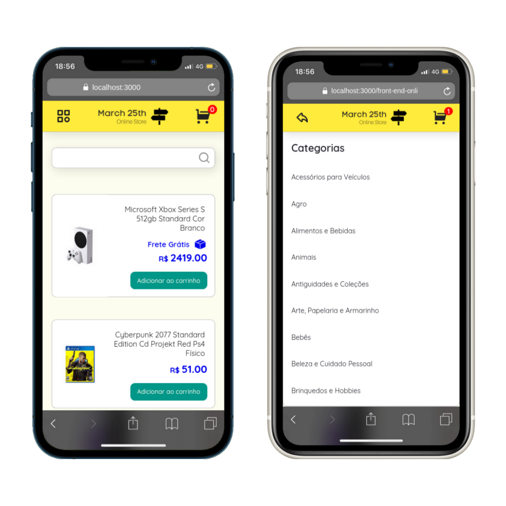

# :shopping: Front-end Online Store

## :page_with_curl: About

React group project developed by [Raphael Martins](https://www.linkedin.com/in/raphaelameidamartins/), [Lazaro Andriola](https://github.com/lazaroor), [Maria Júlia Penha Domenciano](https://github.com/MajuPenha), [Leo Begnossi](https://github.com/MadOrchid) and [Thamires Aparecida](https://github.com/thamiresl) at the end of Unit 13 ([Front-end Development Module](https://github.com/raphaelalmeidamartins/trybe_exercicios/tree/main/2_Desenvolvimento-Front-end)) of Trybe's Web Development course. We were approved with 100% of the mandatory and optional requirements met.

We had to develop a Online Store React application fetching for products data from the Mercado Livre's API. We also had to use agile methologies such as Scrum and Kanban.

[Click here](https://raphaelalmeidamartins.github.io/front-end-online-store/#/) to check out the final version of the project on your browser.

## :memo: Methodologies

* Mobile First
* Kanban
* Scrum

## :man_technologist: Developed Skills

* Work in group using agile development methodologies
* Develop a React application using React Router
* Fetch data from a public API

## :hammer_and_wrench: Tools

* HTML5
* CSS3
* Sass
* JavaScript ES6+
* React.js
* React Icons (icon library)
* GitHub Pages

## :iphone: Mobile version

## :trophy: Grade

### :copyright: Copyright disclaimer

We developed this project for learning purposes, all the code and documentation texts are our authorship, and the rights belong exclusively to us. It is allowed to download or clone the repository for study purposes. However, it is not allowed to publish full or partial copies. This disclaimer does not cover libraries and dependencies, which are subject to their respective licenses.
